🧠 **Online Retail Performance Analytics** An end-to-end analytics solution for customer segmentation, revenue forecasting, and business KPI tracking
**Tools**: SQL, Python, Power BI

---

## 📚 Table of Contents

- [📁 Folder Structure](#1--folder-structure)
- [🧠 Project Overview](#2--project-overview)
- [📊 Dataset and Objectives](#3--dataset-and-objectives)
- [📈 Interactive Dashboard (Power BI)](#4--interactive-dashboard-power-bi)
- [🌟 Business Questions Answered](#5--business-questions-answered)
- [🔍 Key Insights](#6--key-insights)
- [🔍 Insights Deep-Dive](#7--insights-deep-dive)
- [✅ Recommendations](#8--recommendations)
- [⚠️ Limitations & Assumptions](#9--limitations--assumptions)

---

## 1. 📁 Folder Structure

```
online-retail-performance-analytics/

├── data/                                        # Raw data
├── notebooks/                                   # Jupyter Notebooks
├── outputs/                                     # Cleaned data and outputs
├── screenshots/                                 # Dashboard visuals
├── sql/                                         # SQL script
├── Online Retail Performance Dashboard.pbix/    # Power BI .pbix file
├── Online Retail Performance Dashboard.pdf/     # Power BI .pdf file
└── README.md                                    # Project documentation
```

---

## 2. 🧠 Project Overview

This project explores online retail data to understand customer behavior, identify valuable segments, and forecast future sales.
It combines:

* SQL for raw data aggregation
* Python for EDA, customer segmentation and forecasting
* Power BI for interactive business reporting

---

## 3. 📊 Dataset and Objectives

* **Data type**: Online transactions (orders, products, customers)
* **Objective 1**: Identify high-value customer segments
* **Objective 2**: Forecast revenue based on historical behavior
* **Objective 3**: Build an interactive dashboard for business teams

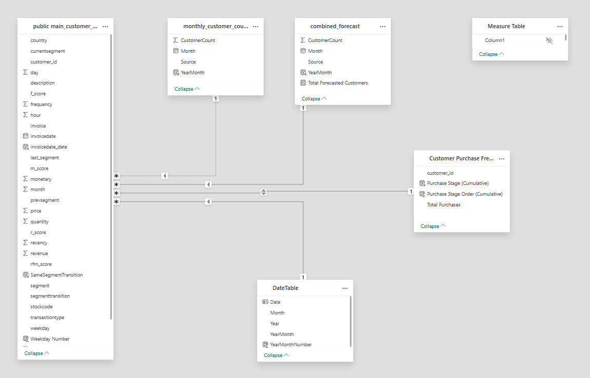
---

## 4. 📈 Interactive Dashboard (Power BI)

**File**: `Online_Retail_Performance_Dashboard.pbix`

### 🗂️ General (Overview)

KPIs & trends: Revenue, Orders, AOV, geography, return rate, seasonal trends

### 📜 Customer & Product Details

New vs. returning customers, top customers, product-level revenue & frequency, segment breakdown

### 📈 Growth

Revenue growth by month/year, MoM change, key trend insights

### 🔮 Year-End Prediction

Forecasted customer count via SARIMA (July–Dec 2012)

### 🔄 Segment Transition

Bar chart, Sankey diagram, and matrix of customer movements between RFM segments

### 🔁 Purchase Stages

Funnel + repeat rate breakdown (1st to 5+ purchases), gauge & donut charts, annual trends

---

## 5. 🌟 Business Questions Answered

* Who are our most valuable customers, and how can we retain them?
* What are the key patterns in customer purchasing behavior?
* How are sales and customer engagement evolving over time?
* What products and segments contribute the most to revenue?
* How do customers transition between loyalty segments?
* What is the forecasted customer demand for the upcoming period?
* How effectively are we converting first-time buyers into repeat customers?

---

## 6. 🔍 Key Insights

* 💎 Champions contribute the highest revenue with strong loyalty and high AOV.
* ♻️ 75% repeat rate — strong retention but some customers only purchase once.
* 📈 May 2011 shows highest growth; Dec 2011 sharpest decline.
* 🌍 UK is top market, but segment mix varies across countries.
* 🍭 Bestsellers differ from top revenue drivers — high volume vs. high value.
* 🔮 SARIMA forecasts 4,855 customers (Jul–Dec 2012).
* 🔄 Transition: "Others" to "Loyal Customers" is most common.
* 🔬 Revenue growth varies by segment — segment-based marketing is key.

---

## 7. 🔍 Insights Deep-Dive

### 💾 General

* Basic KPI's:
 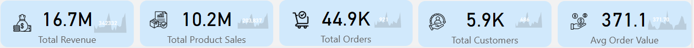
* Revenue peaks in Nov/Dec ✔ weekday shopping trend (Wed & 9 AM–3 PM)
  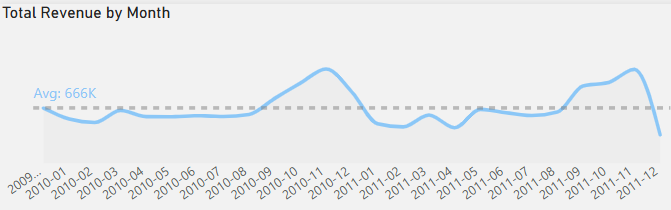
* UK leads revenue; "Loyal Customers" segment orders most frequently
  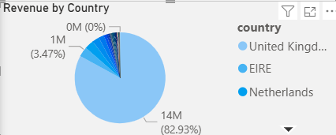
  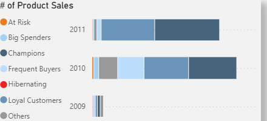

### 👤 Customer & Product Details

* Top customers: high volume vs. high value
* Most joined in 2010; UK hosts most Champions
* Best-selling product: *WHITE HANGING HEART T-LIGHT HOLDER*
* Top revenue product: *REGENCY CAKESTAND 3 TIER*
  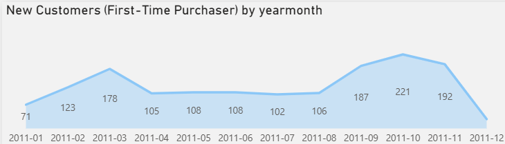

### 📈 Growth

* May 2011 = best growth; Dec 2011 = sharp drop
* Clear seasonal trends; narrative box summarizes changes
  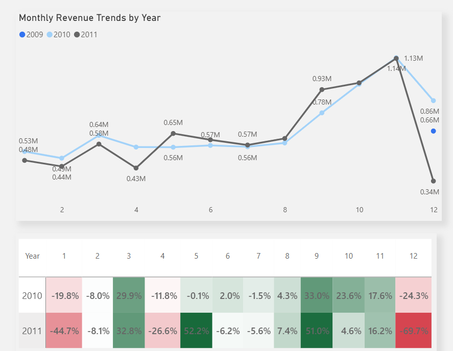

### 🔮 Year-End Prediction

* Peak in Dec 2012: 1,188 customers
* Total (Jul–Dec 2012): 4,855
* Seasonal trend well captured by SARIMA
  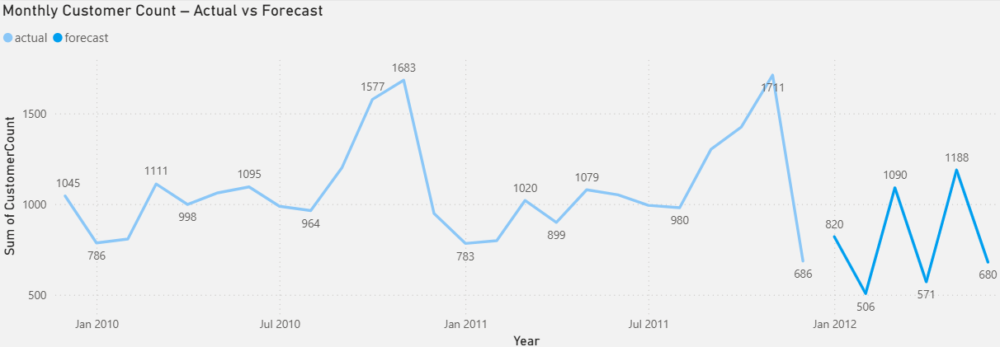

### 🔄 Segment Transitions

* Most common: Others → Loyal Customers
* Backward transitions show churn risk
  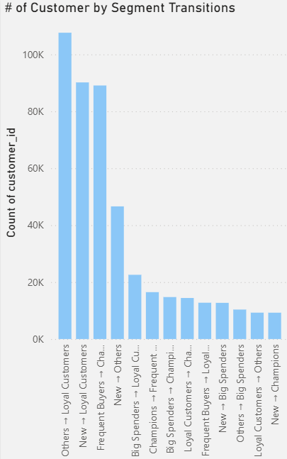
  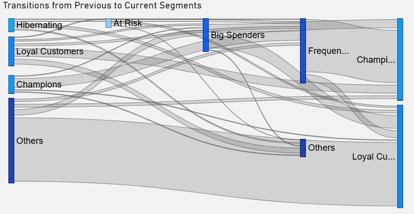

### 🔁 Purchase Stages

* 75% repeat rate, but most stop at 2–3 purchases
* Repeat share increased in 2010 & 2011
* Funnel/gauge highlight loyalty funnel performance
  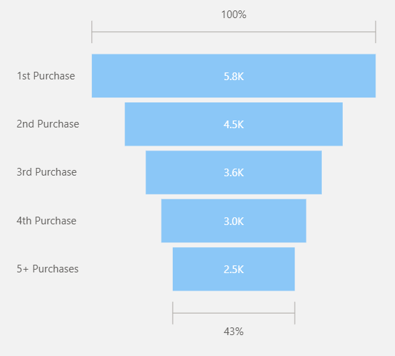
  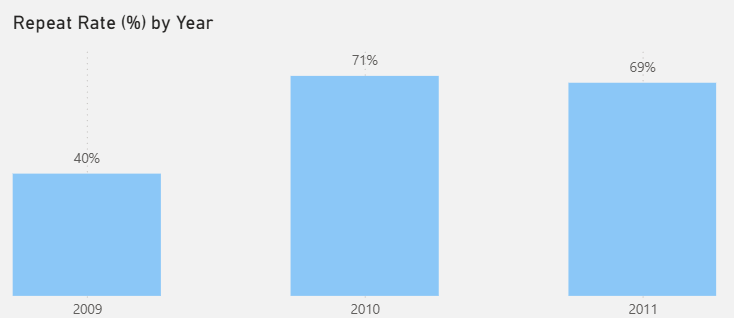
  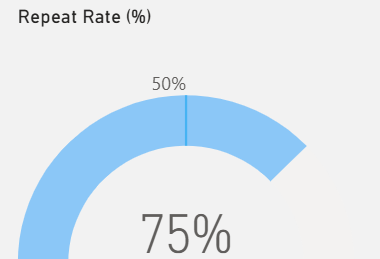

---

## 8. ✅ Recommendations

1. **Strengthen Loyalty Campaigns for “Others” Segment**
   ➤ Launch reactivation flows to convert one-timers

2. **Capitalize on Seasonal Peaks**
   ➤ Align inventory & ads to Nov-Dec surge; soften low-season drop

3. **Boost Retention Through Post-Purchase Journeys**
   ➤ Push 2nd-3rd purchase via upselling & loyalty incentives

4. **Optimize Product Strategy (Volume vs. Value)**
   ➤ Bundle low-value bestsellers to improve AOV

5. **Invest in High-Performing Segments**
   ➤ Offer exclusives to Champions/Loyal; use lookalike targeting

6. **Prepare for Q4 Surge (Forecast)**
   ➤ Allocate support/resources for Dec 2012 peak

7. **Address Dec 2011 Revenue Drop**
   ➤ Investigate and fix stock/delivery/campaign issues

8. **Time-Slot Targeting**
   ➤ Optimize email/ad timings to weekday mornings for ROI

---

## 9. ⚠️ Limitations & Assumptions

### 📆 Data Scope and Timeframe

* Covers 2009–2011; Forecast up to mid-2012
* No recent trends or new market dynamics reflected

### ❓ Missing Customer IDs

* Some rows excluded due to `customer_id` issues
* Impacts RFM and repeat rate calculations

### ⏱ Forecasting Assumptions

* SARIMA assumes historical seasonality holds
* 2012+ macro/micro events not captured

### 🔄 Segment Definitions (RFM)

* Based on quantile thresholds for Recency, Frequency, Monetary
* Labels (e.g., "At Risk") are relative to current data only

### 👜 Limited Product Attributes

* Inconsistent product names; no standardized categories or brands
* Restricts brand-level insights and clustering

---
